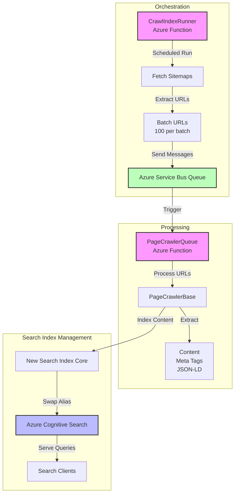

# WebCrawler

Simple web crawler that indexes pages to Azure Cognitive Search.

### Architecture diagram


## KT meeting recording

[Video Recording](https://xcentium-my.sharepoint.com/:v:/r/personal/ansley_teipel_xcentium_com/Documents/Recordings/Catalyst_%20Internal%20KT%20-%20Azure%20Search%20with%20Contentstack-20241211_160245-Meeting%20Recording.mp4?csf=1&web=1&e=cJzmV3&nav=eyJyZWZlcnJhbEluZm8iOnsicmVmZXJyYWxBcHAiOiJTdHJlYW1XZWJBcHAiLCJyZWZlcnJhbFZpZXciOiJTaGFyZURpYWxvZy1MaW5rIiwicmVmZXJyYWxBcHBQbGF0Zm9ybSI6IldlYiIsInJlZmVycmFsTW9kZSI6InZpZXcifX0%3D)

## Architecture

The web crawler system is designed to efficiently index web content into Azure Cognitive Search with zero-downtime updates. Here's how it works:

### 1. CrawlIndexRunner (Orchestrator)

- Azure Function that runs on a configurable schedule (cron expression)
- Responsibilities:
  - Fetches and processes sitemaps from the configured `SitemapsRootUrl`
  - Handles both sitemap index files and regular sitemaps
  - Batches URLs (up to 100 URLs per batch)
  - Sends URL batches to Azure Service Bus queue
  - Manages index core switching through "begin" and "end" swap commands

### 2. PageCrawlerQueue (Processor)

- Azure Function triggered by Service Bus queue messages
- Features:
  - Processes URL batches concurrently (configurable concurrency)
  - Implements retry logic with configurable attempts
  - Extracts content using specialized TextExtractor
  - Inherits core crawling logic from PageCrawlerBase

### 3. Core Functionality (PageCrawlerBase)

- Shared crawling and indexing functionality:
  - Manages Azure Search index operations
  - Extracts structured content:
    - Meta tags (configurable via MetaFieldMappings)
    - JSON-LD data (configurable via JsonLdMappings)
    - Page content using TextExtractor
  - Handles index lifecycle management

### 4. Index Core Switching Process

1. Crawling Begins:
   - Creates new index core: `{indexBaseName}-{timestamp}`
   - Initiated by "begin" swap command
2. During Crawling:
   - New content indexed to new core
   - Existing core continues serving searches
3. Completion:
   - "End" swap command triggers index switch
   - Search alias updated to new core
   - Old index optionally deleted

### Key Features

- Zero-downtime search index updates
- Scalable processing through message queues
- Fault tolerance with retry mechanism
- Configurable structured data extraction
- Clean separation between orchestration and processing

### Configuration

The system is highly configurable through environment variables and settings:

- Crawling concurrency and retry settings
- Search service endpoints and credentials
- Field mappings for meta tags and JSON-LD
- Facet configurations
- Index naming and lifecycle management

## Functions

### CrawlIndexRunner

Timer-triggered function to grab sitemap index and queue up sitemap urls for processing

### PageCrawlerQueue

Pick up a sitemap urls from the queue and crawl the page

### PageCrawlerHttp

Index URLs from the passed payload

### Queue message / payload format

Set source to source sitemap url and urls to the list of urls to index when indexing is triggered by CrawlIndexRunner

```json
{
  "source": "https://www.catalyst.org/post-sitemap.xml",
  "urls": [
    "https://www.catalyst.org/2020/08/10/racism-gender-pay-gap-women/",
    "https://www.catalyst.org/2021/04/27/future-of-work-summit-europe-2021-takeaways/"
  ]
}
```

## Azure environments

You'll need to get access from Catalyst team.
Each environment has it's own Azure Resource Group. Each resource group has it's own Azure Search Service, Service Bus Queue, and Azure function app, holding the indexing functions.

### DEV

[rg-contentsearch-dev](https://portal.azure.com/#@catalyst.org/resource/subscriptions/867e00ef-3f48-4b6b-acac-c259c5cbde65/resourceGroups/rg-contentsearch-dev/overview)

### STAGE

[rg-dfd-stage-000](https://portal.azure.com/#@catalyst.org/resource/subscriptions/867e00ef-3f48-4b6b-acac-c259c5cbde65/resourceGroups/rg-dfd-stage-000/overview)()

### PROD

[rg-dfd-prod-000](https://portal.azure.com/#@catalyst.org/resource/subscriptions/867e00ef-3f48-4b6b-acac-c259c5cbde65/resourceGroups/rg-dfd-prod-000/overview)

## How to trigger indexing manually from Azure Portal
There are several ways to trigger a timer Azure function:

### Scheduled Execution

By default, timer-triggered Azure functions run on a schedule defined by a CRON expression. For example, to run a function every 5 minutes, you would use the CRON expression "0 */5 * * * *"[3].

### Manual Triggering

To manually trigger a timer function outside its scheduled time:
**Use the Azure Portal**:
   - Navigate to your function in the Azure portal (open function app -> Overview -> find CrawlIndexRunner & click on it)
   - Select "Code + Test"
   - Click "Test/Run" to manually execute the function

### More details on time-triggered functions
* [Azure Timer Function: How to Force Immediate Execution](https://kumarashwinhubert.com/azure-timer-function-how-to-force-immediate-execution-with-manual-triggering)
* [Working With Timer-Triggered Azure Functions](https://www.c-sharpcorner.com/article/working-with-timer-trigger-azure-functions)
* [Timer trigger for Azure Functions](https://learn.microsoft.com/en-us/azure/azure-functions/functions-bindings-timer?tabs=in-process&pivots=programming-language-python)
* [Azure function app | Timer trigger run manually](https://learn.microsoft.com/en-us/answers/questions/1104850/azure-function-app-timer-trigger-run-manually)


## Configuration items template

These values need to be set in the Azure Function configuration (environment variables) to run functions in Azure or local.settings.json to run locally.

```json
{
  "IsEncrypted": false,
  "Values": {
    "AzureWebJobsStorage": "UseDevelopmentStorage=true",
    "FUNCTIONS_WORKER_RUNTIME": "dotnet-isolated",
    "ServiceBusQueueName": "catalyst-indexing-queue",
    "ServiceBusConnection": "[your service busconnection string]",
    "CrawlIndexSchedule": "0 0 31 2 *",
    "SitemapsRootUrl": "https://www.catalyst.org/sitemap_index.xml",
    "SearchServiceEndpoint": "[your search service endpoint]",
    "SearchIndexAlias": "catalyst-az-poc-alias",
    "SearchIndexBaseName": "catalyst-az-poc",
    "DeleteOldIndexOnSwap": "true",
    "SearchApiKey": "[your search api key]",
    "CrawlerUserAgent": "Mozilla/5.0 (Windows NT 10.0; Win64; x64) AppleWebKit/537.36 (KHTML, like Gecko) Chrome/91.0.4472.124 Safari/537.36",
    "pageContentExpression": "",
    "CrawlerMaxConcurrency": 3,
    "CrawlerMaxRetries": 3,
    "ContentTypeFacetName": "facet_Content_Type_bltedec8785cf776886",
    "EventTypeFacetName": "facet_Event_Type_blta4cbd29d70185dba",
    "EventFacetValue": "facet_Event_blt3464588e70baf655",
    "TagFacetName": "facet_Tag_blta9037e9c8b7e92de",
    "DateFacetName": "facet_Date_bltab4886af92871fb5",
    "EventTypeMapping": "Hybrid:facet_Hybrid_bltfb073526168673ad;In Person:facet_In_Person_blt3740597b9d1a007e;Webinar:facet_Webinar_bltb7dc56fbf8c0089c;Virtual:facet_Virtual_blt9cb524692e7be8e6",
    "CventServiceEndpoint": "https://api-platform.cvent.com",
    "CventClientId": "[your cvent client id]",
    "CventClientSecret": "[your cvent client secret]"
  },
  "MetaFieldMappings": [
    {
      "SourceMetaTag": "og:locale",
      "TargetField": "locale",
      "TargetType": "String"
    },
    {
      "SourceMetaTag": "og:type",
      "TargetField": "type",
      "TargetType": "String"
    },
    {
      "SourceMetaTag": "og:title",
      "TargetField": "meta_title",
      "TargetType": "String"
    },
    {
      "SourceMetaTag": "og:description",
      "TargetField": "meta_description",
      "TargetType": "String"
    },
    {
      "SourceMetaTag": "og:image",
      "TargetField": "meta_image",
      "TargetType": "String"
    },
    {
      "SourceMetaTag": "author",
      "TargetField": "meta_author",
      "TargetType": "String"
    },
    {
      "SourceMetaTag": "article:published_time",
      "TargetField": "meta_published_time",
      "TargetType": "DateTime"
    },
    {
      "SourceMetaTag": "article:modified_time",
      "TargetField": "meta_modified_time",
      "TargetType": "DateTime"
    }
  ],
  "JsonLdMappings": [
    {
      "SourceElementPath": "@graph.[?(@.@type=='WebPage')].datePublished",
      "TargetField": "ld_datePublished",
      "TargetType": "datetime"
    },
    {
      "SourceElementPath": "@graph.[?(@.@type=='WebPage')].dateModified",
      "TargetField": "ld_dateModified",
      "TargetType": "datetime"
    },
    {
      "SourceElementPath": "@graph.[?(@.@type=='WebPage')].description",
      "TargetField": "ld_description",
      "TargetType": "string"
    },
    {
      "SourceElementPath": "@graph.[?(@.@type=='WebSite')].name",
      "TargetField": "ld_site_name",
      "TargetType": "string"
    },
    {
      "SourceElementPath": "@graph.[?(@.@type=='WebSite')].description",
      "TargetField": "ld_site_description",
      "TargetType": "string"
    },
    {
      "SourceElementPath": "@graph.[?(@.@type=='Event')].location.name",
      "TargetField": "ld_location_name",
      "TargetType": "string"
    }
  ]
}
